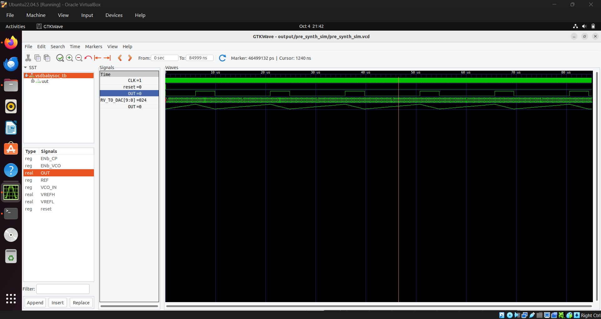

# RISC-V SOC tapeout program : Week2

# Introduction to BabySoC & Functional Modelling

---

**Objective** : To build a solid understanding of SoC fundamentals and practice functional modelling of the BabySoC using simulation tools (Icarus Verilog & GTKWave).

### 1. **Introduction on SoC**

 - SoC (System on Chip): These are integrated circuit chips that have multiple components (IPs) in it, forming complete system, within a single chiip. These could be digital or analog components. 
 - These chips can include components such as central processing unit, memory components, input-output interfaces, timers, secondary storage units etc.
 - Integrating all components into a single chip decreases the distance between them which gives a upperhand in area and power consumption.
 - SoCs can be built around microprocessors or microprocessors

### 2. **SoC structure**

An SoC is a highly integrated circuit designed as a complete electronic system on a single chip. Its structure consists of two main parts:

#### 1. Functional Units (The "System" Components)

These are the core hardware modules responsible for processing and operation:

 - Processor Cores: The central processing units (CPUs) that run the operating system and application software.
 - Memory: Various types of on-chip storage for data and instructions (e.g., caches, RAM, ROM).
 - Interfaces: Input/Output (I/O) ports for communicating with external devices (e.g., USB, display drivers, wireless controllers).
 - Digital Signal Processors (DSPs) & Others: Specialized hardware units, like Graphics Processing Units (GPUs) or dedicated accelerators, used for tasks such as signal processing, multimedia, and AI.

#### 2. Communication Subsystem (The "Chip" Interconnect)

This is the internal infrastructure dedicated to connecting, controlling, and directing data flow between all functional units:

- Intermodule Communication: This network ensures that the separate components can efficiently exchange data.
- Bus-Based Communication: Traditionally, this relied on high-speed, shared communication lines (buses).
- Network-on-a-Chip (NoC): Modern, complex SoCs often use an NoC architecture, which is a packet-switched network (like a tiny internet) on the chip to handle higher bandwidth and concurrency demands, offering more scalable and efficient communication than traditional shared buses.

### 3. **Introduction to BabySoC**

#### 1. Components

The BabySoC is a mixed-signal chip that integrates the following three main IP (Intellectual Property) cores:

 - RVMYTH Microprocessor (Digital): This is the Central Processing Unit (CPU) core of the SoC. It is a simple RISC-V-based processor used to execute instructions stored in its internal memory.It handles the digital processing and control functions of the system.

 - Phase-Locked Loop (PLL) (Mixed-Signal): The PLL acts as the system's clock generator and controller. It's purpose is to generate a stable, high-frequency clock signal to synchronize and drive all other digital components, including the RVMYTH core.

 - Digital-to-Analog Converter (DAC) (Analog): This is a 10-bit DAC used for communication with the analog world. It takes the digital values generated by the RVMYTH processor and converts them into a corresponding analog output signal (e.g., for audio or video display).

#### 2. A simplified model for learning SoC 
 - Compared to other SoC which have more components and are complex, BabySoC have only three components and is a simple system.
 - The RISC-V architecture being fully open source helps in the learning process.

### 4. **Functional Modelling**
 - Serves as the bridge between high-level architectural concepts and detailed register-transfer level (RTL) implementation.
 - Functional modelling validates the system's logic and behavior before committing to costly and time-consuming physical design.

#### Functional Modeling Steps

 - Specification & Partitioning :
   - Define Requirements such as system's core functions, interfaces, and performance goals.
   - Divide System: Break the design into major functional blocks (IP cores) and define their conceptual interactions.
 - High-Level Coding :
   - Algorithm Translation: Write core algorithms in a high-level language (C/C++ or untimed HDL).
   - Behavioral Modeling: Model each block's behavior, focusing only on logical correctness while deliberately ignoring detailed timing and clock cycles. This creates the Golden Reference Model.
     
 - Simulation & Debugging:
   - Generate Stimuli: Create comprehensive input test vectors.
   - Fast Simulation: Run the vectors through the model quickly to debug all algorithmic and logical flaws.
  
  ### 5.Lab:

  #### 1. Presynthesis simulation

  

